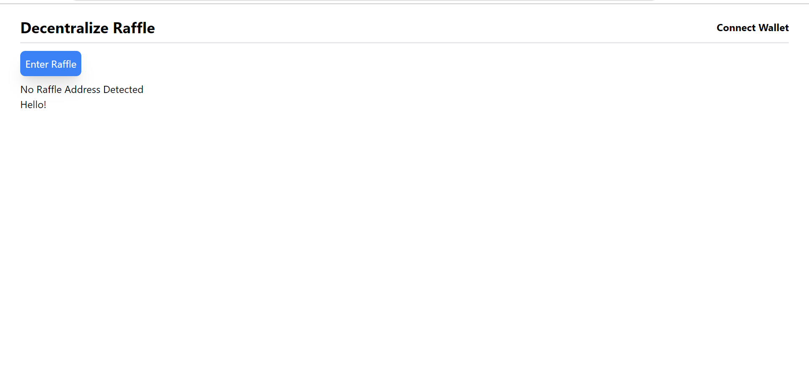

  ## Next-JS Hardhat-Decentralized-Raffle

  Tools needed to interact 
  - Metamask
  - import one of the hardhat node into your metamask
  - a browser
  
  
  ### 🧨🧨 How to interact with the Raffle
  - connect with your account using the metamask(please make sure you are not on the real network(mainnet) if you are your real funds will be used to enter the    decentarlized raffle, make use of testnets e.g goerli, or hardhat-node accounts 
  - after connecting enter the raffle using the enter the raffle button
  - after that a pop will show requiring your digital signature to sign the transaction 
  -after you hae signed up a notification will show from the top right corner indicating a successful transaction, after this the number of participants will increase
  - If it fails please check your console .

  
  ## ⛓⛓⚙⚙ Dependencies
    - react-moralis
    - next js
    - web3uikit
    - TailwindCss
    
 
## 🚲 Link to the decentralized raffle 
 [The hardhat Raffle](https://shiny-meadow-1882.on.fleek.co/)
    
-
